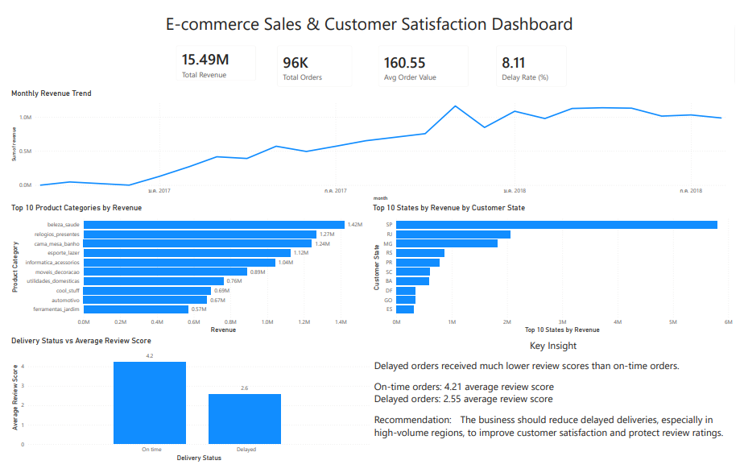

# E-commerce Sales & Customer Satisfaction Analysis

## Project Overview

This project analyzes e-commerce sales performance, customer regions, product categories, delivery performance, and customer satisfaction using SQL and Power BI.

The main goal is to identify key business drivers behind revenue and understand how delivery delays affect customer review scores.

## Business Questions

1. What is the overall sales performance?
2. Which product categories generate the highest revenue?
3. Which customer states contribute the most revenue?
4. How does revenue change over time?
5. Do delivery delays affect customer review scores?

## Tools Used

- SQL
- SQLite / DB Browser for SQLite
- Power BI
- CSV data processing

## Dataset

The dataset contains e-commerce transaction data, including:

- Orders
- Order items
- Customers
- Products
- Reviews
- Payments

## Key Metrics

| Metric | Value |
|---|---:|
| Total Revenue | 15.49M |
| Total Orders | 96,478 |
| Average Order Value | 160.55 |
| Delay Rate | 8.11% |

## Dashboard

## Key Findings

### 1. Sales Performance

Total revenue reached 15.49M from 96,478 orders. The average order value was 160.55, suggesting that revenue was mainly driven by order volume rather than high-value individual purchases.

### 2. Monthly Revenue Trend

Revenue increased strongly throughout 2017 and became more stable in 2018, staying around 1 million per month.

### 3. Top Product Categories

The highest revenue-generating category was Beauty & Health, followed by Watches & Gifts and Bed/Table/Bath products.

### 4. Top Customer Regions

São Paulo (SP) generated the highest revenue by a large margin, followed by Rio de Janeiro (RJ) and Minas Gerais (MG). This shows that sales were highly concentrated in major economic regions.

### 5. Delivery Delay and Customer Satisfaction

Delivery delays had a clear negative impact on customer satisfaction.

| Delivery Status | Average Review Score |
|---|---:|
| On-time orders | 4.21 |
| Delayed orders | 2.55 |

Delayed orders received much lower review scores than on-time orders.

## Business Recommendation

The business should reduce delayed deliveries, especially in high-volume regions, to improve customer satisfaction and protect review ratings.

The company should also focus marketing campaigns on high-performing product categories and maintain strong service quality in top revenue-generating states.

## Project Files

- `dashboard/ecommerce_dashboard.pbix` — Power BI dashboard
- `screenshots/dashboard_screenshot.png` — dashboard screenshot
- `sql/analysis_queries.sql` — SQL queries used in the analysis
- `data/exported_csv_files/` — cleaned and aggregated CSV files used in Power BI